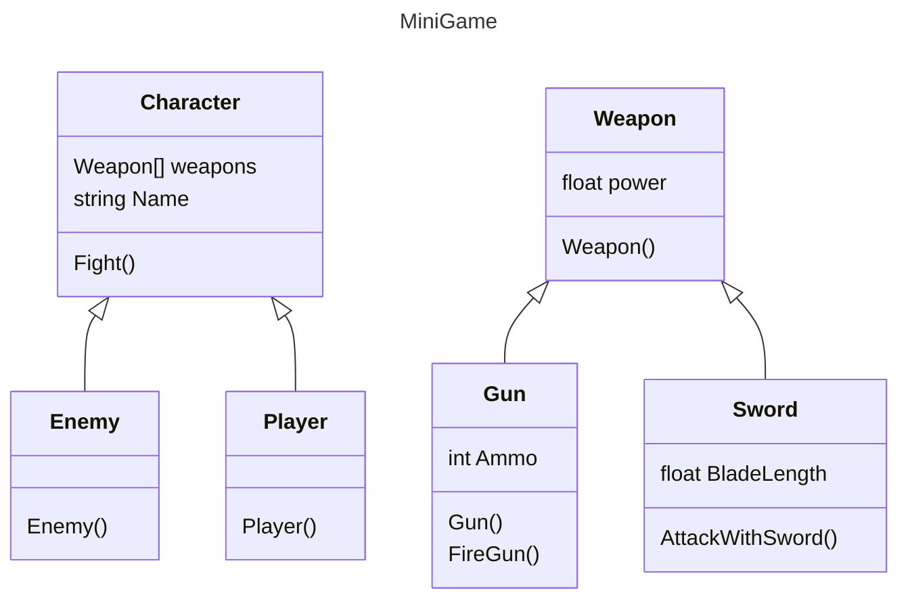

```mermaid
---
title: MiniGame
---
classDiagram
Character : Weapon[] weapons
Character : string Name
Character : Fight()

Character <|-- Enemy
Enemy : Enemy()

Character <|-- Player
Player : Player()

Weapon : float power
Weapon : Weapon()

Weapon <|-- Gun
Gun : int Ammo
Gun : Gun()
Gun : FireGun()

Weapon <|-- Sword
Sword : float BladeLength
Sword : AttackWithSword()
```